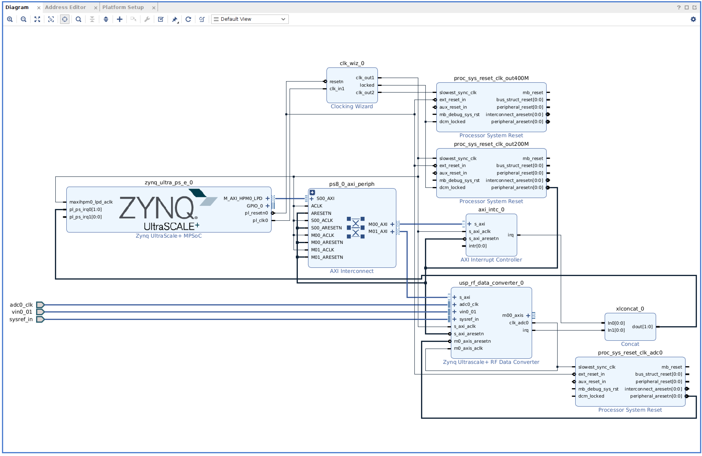

# A Vitis Extensible Platform with a single ADC for RFSoC4x2 (Vitis 2023.2.1 Unified IDE)
This is an attempt to migrate [A Vitis Extensible Platform with a single ADC for RFSoC4x2](./vitis_adc_platform_classicIDE.md) to the Vitis 2023.2 Unified IDE. Steps 0 to 2 are exactly the same as those before.


## Step 0: Install the RFSoC4x2 board files
If not already installed, do the following steps to install the RFSoC board files:
1. Get the board files from the [RealDigital repo](https://github.com/RealDigitalOrg/RFSoC4x2-BSP)
   ```shell
   git clone https://github.com/RealDigitalOrg/RFSoC4x2-BSP.git ~/workspace/RFSoC4x2-BSP
   ```
   The board files are in  `~/workspace/RFSoC4x2-BSP/board_files/rfsoc4x2`.
  
2. Add the board files to Vivado:
   Add the following line to Vivado startup script `~/.Xilinx/Vivado/Vivado_init.tcl` (if the file doesn't exist, add it):
   ```tcl
   set_param board.repoPaths [list "<full path to home directory>/workspace/RFSoC4x2-BSP"]
   ```

## Step 1: Create a Vivado Hardware Design
1. Download the TCL script [rfsoc_adc_hardware.tcl](src/vitis_adc_platform/rfsoc_adc_hardware_2023_2_1.tcl) to `~/workspace`.
2. Open Vivado and source the TCL script a TCL shell, or simply do
   ```bash
   vivado -source rfsoc_adc_hardware_2023_2_1.tcl
   ```
   to generate the following block design:
   
   which adds an [RF Data Converter](https://www.xilinx.com/products/intellectual-property/rf-data-converter.html#overview) IP to a slightly modified version of the hardware design in [Vitis Platform Creation Tutorial for
ZCU104-Step 1](https://github.com/Xilinx/Vitis-Tutorials/blob/2023.1/Vitis_Platform_Creation/Design_Tutorials/02-Edge-AI-ZCU104/step1.md).
   - The Vivado project is named `rfsoc_adc_hardware`.
   - ADC-D (ADC0 on tile 224) on the RFSoC4x2 board is enabled with sampling rate set to 2.4576 GSps.

3. Export the platform `rfsoc_adc_hardware.xsa` for hardware and platform `rfsoc_adc_hardware_emu.xsa` for hardware emulation. 

## Step 2: Use Petalinux to create boot files, device tree file, linux image, rootfs, and sysroot
1. Create a Petalinux project: 
   ```shell
   cd ~/workspace
   petalinux-create -t project --template zynqMP -n rfsoc-linux
   cd rfsoc-linux
   ```
2. Enter the hardware plotform `rfsoc_adc_hardware.xsa` and select EXT4 for rootfs:
   ```shell
   petalinux-config --get-hw-description=../rfsoc_adc_hardware/rfsoc_adc_hardware.xsa
   ```
   - Select **<em>Image Packaging Configuration->Root filesystem type->EXT4</em>**
   - Exit and save configuration
3. Add relevant libraries to rootfs:
   - Add the following line to `~/workspace/rfsoc-linux/project-spec/meta-user/conf/user-rootfsconfig`:
     ```
     CONFIG_rfdc
     ```
     to allow including the `rfdc` library (we don't use it in this experiment though)
   - Run
     ```shell
     petalinux-config -c rootfs
     ```
   - Select **<em>user packages->rfdc</em>**  
   - Select `xrt`:
     - **<em>Petalinux Package Groups->packagegroup-petalinux-vitis-acceleration-essential->packagegroup-petalinux-vitis-acceleration-essential</em>**
     - **<em>Petalinux Package Groups->packagegroup-petalinux-vitis-acceleration-essential->packagegroup-petalinux-vitis-acceleration-essential-dev</em>**
   - Select `libmetal` (mostly for `rfdc`):
     - **<em>Petalinux Package Groups->packagegroup-petalinux-openamp->packagegroup-petalinux-openamp</em>**
     - **<em>Petalinux Package Groups->packagegroup-petalinux-openamp->packagegroup-petalinux-openamp-dev</em>**
   - Select Python (to run some PYNQ scripts later):
     - **<em>Petalinux Package Groups->packagegroup-petalinux-python-modules->packagegroup-petalinux-python-modules</em>**
     - **<em>Petalinux Package Groups->packagegroup-petalinux-python-modules->packagegroup-petalinux-python-modules-dev</em>**
   - Select `openssh` for convenience:
     - **<em>Filesystem Packages->console->network->openssh->openssh, openssh-ssh, openssh-sshd, openssh-scp</em>**
   - Select **<em>Image Features->package-management</em>** and **<em>Image Features->debug-tweaks</em>**
   - Select any other packages as wish
   - Exit and save
4. Configure the Linux kernel:
   ```shell
   petalinux-config -c kernel
   ```
   - Allow user-mode SPI device driver support:
     - Select **<em>Device Drivers->SPI support->User mode SPI device driver support</em>** (select the * mark)
   - Exit and save
5. Add device tree descriptions to enable access to the reference clock chips (LMK04828 and LMX2594) via SPI:
   - Add the following lines to `~/workspace/rfsoc-linux/project-spec/meta-user/recipes-bsp/device-tree/files/system-user.dtsi`:
     ```
     /include/ "system-conf.dtsi"
     / {
        chosen {
                bootargs = " earlycon console=ttyPS0,115200 clk_ignore_unused root=/dev/mmcblk0p2 rw";
                stdout-path = "serial0:115200n8";
        };
     };

     &spi0 {
        lmk@0 {
                compatible = "ti,lmk04828";
                reg = <0x0>;
                spi-max-frequency = <500000>;
                num_bytes = <3>;
        };
        lmxdac@1 {
                compatible = "ti,lmx2594";
                reg = <0x1>;
                spi-max-frequency = <500000>;
                num_bytes = <3>;
        };
        lmxadc@2 {
                compatible = "ti,lmx2594";
                reg = <0x2>;
                spi-max-frequency = <500000>;
                num_bytes = <3>;
        };
     };
     ```
6. Build the image and sysroot:
   ```bash
   petalinux-build
   petalinux-build --sdk
   cd images/linux
   ./sdk.sh -d .
   ```
   - The boot files, device tree file, kernel image, and the EXT4 rootfs are generated in `~/workspace/rfsoc-linux/images/linux/`. The sysroot is in `~/workspace/rfsoc-linux/images/linux/sysroots/cortexa72-cortexa53-xilinx-linux`.
     
## Step 3: Create a Vitis Platform Component
Download the Python script [`create_rfsoc_adc_vitis_platform.py`](src/vitis_adc_platform/create_rfsoc_adc_vitis_platform.py) to `~/workspace` and run
```shell
vitis -s create_rfsoc_adc_vitis_platform.py
```
to create and build the platform component `rfsoc_adc_vitis_platform` in `~/workspace`. You can also run the python script line by line in the Vitis interactive mode (`vitis -i`).
 
## Step 4: Test the Vitis Platform on the RFSoC4x2 board
0. Start Vitis Unified IDE:
   ```shell
   vitis -w ~/workspace
   ```
1. Create a new Vitis system project from template:
   - Add Vitis example templates:
     - Go to **<em>View->Examples</em>** or click the `Examples` button on the left widown edge to open the EXAMPLES view
     - Click the `Download` (a downarrow pointing to a bar) button to install the templates from the **<em>Vitis Accel Examples Repository</em>**
     - Only need to do this once
   - Select **<em>Vitis Accel Examples Repository->Host Examples->Data Transfer (C)</em>** in the EXAMPLES view to open up the example.
   - Click the `Create Application from Template` button to create a system project from the example template:
     - Name the project `test_adc`. Press the `Next` button.
     - Select the `rfsoc_adc_vitis_platform` created in Step 3. If the platform doesn't show up as a choice, you can press the **+** button to add it. Press the `Next` button.
     - Enter `Embedded Component Paths`:
       - `Kernel Image`: Click the `Browse` button to select `~/workspace/rfsoc-linux/images/linux/Image`.
       - `Root FS`: Click the `Browse` button to select `~/workspace/rfsoc-linux/images/linux/rootfs.ext4`.
       - `Sysroot`: Click the `Browse` button to select `~/workspace/rfsoc-linux/images/linux/sysroots/cortexa72-cortexa53-xilinx-linux`.
       - Check the `Update Workspace Perference` box so that  don't need to enter the info again.
       - Press the `Next` and the `Finish` buttons to generate the project.
   - You show see the following three components added to the WORKSPACE view:
     - **test_adc [rfsoc_adc_vitis_platform]**: System project
     - **test_adc_dummy_kernel [HLS]**: HLS component
     - **test_adc_host [Application]**: Application component    
  
2. Modify the HLS kernel and host source codes and build the project:
   - Modify sources:
     - Under the WORKSPACE view, replace the template file `dummy_kernel.cpp` in **test_adc_dummy_kernel [HLS]->Sources** with this [`dummy_kernel.cpp`](src/vitis_adc_platform/dummy_kernel.cpp).
     - Replace the template file `host.cpp` in **test_adc_host [Application]->Sources->src** with this [`host.cpp`](src/vitis_adc_platform/host.cpp).
   - Specify `v++` linker connectivity:
     - Under the WORKSPACE view, open the configuration file `dummy_kernel-link.cfg` in **test_adc [rfsoc_adc_vitis_platform]->Sources->hw_link**
     - Click the **</>** button to show the config source text and add the following lines to the file: 
       ```
       [clock]
       id=2:dummy_kernel_1

       [connectivity]
       stream_connect = RFDC_AXIS:dummy_kernel_1.s_in
       ```
   - Disable SD card image generation:
     - Under the WORKSPACE view, open the configuration file `package.cfg` in **test_adc [rfsoc_adc_vitis_platform]->Sources->package**
     - Check the box under **Do not create image**
   - Build:
     - Under the FLOW view, select `test_adc` in **Component**   
     - Click **:hammer: HARDWARE->Build All** to build the project

3. Boot up the RFSoC board from an SD card:
   - Insert the SD card into a card reader on the host machine running Vitis. Check its device name:
     ```shell
     lsblk -r -O
     ```
     For example, my SD card is `/dev/sdj`.
   - Follow [these steps](https://xilinx-wiki.atlassian.net/wiki/spaces/A/pages/18842385/How+to+format+SD+card+for+SD+boot) to create a boot partition (FAT32) and a root partition (EXT4) on `/dev/sdj`.
   - Write the rootfs to the root (EXT4) partition:
     ```shell
     sudo dd if=~/workspace/rfsoc-linux/images/linux/rootfs.ext4 of=/dev/sdj2 bs=1M
     sudo resize2fs /dev/sdj2
     ```
   - Mount the boot (FAT32) partition:
     ```shell
     cd ~/workspace
     mkdir mnt
     sudo mount -t vfat /dev/sdj1 mnt
     ```
   - Copy boot files, bit file, and executable to the SD card:
     ```shell
     sudo cp ~/workspace/test_adc/build/hw/package/package/sd_card/* mnt/
     sudo umount mnt
     ```
   - Put the SD card into the microSD slot of the RFSoC4x2 board.
     Use a USB cable to connect the Linux host to the JTAG/UART port on the RFSoC4x2 board.
     Also connect the Ethernet port to a DHCP server if available.
     On the host, run to connect to the UART port (install `picocom` if needed):
     ```shell
     sudo picocom -b 115200 /dev/ttyUSB1
     ```
     Boot up the RFSoC4x2 board.
   - Log in as `root` (default password is `root`, remember to change it after logging in).
     Do `ifconfig` to check the IP address. With the IP address, can also `ssh` in as `root`.
     Petalinux also creates a sudoer with login `petalinux`, whose passwd is set by the user when logging in the first time.

4. Configure and turn on the reference clock chips (LMK04828 and LMX2594) via SPI:
   - `scp` this python package file [`xrfclk-2.0.tar.gz`](src/vitis_adc_platform/xrfclk-2.0.tar.gz) (I hacked out from the [RFSoC-PYNQ distribution](https://github.com/Xilinx/RFSoC-PYNQ/tree/master/boards/RFSoC4x2)) to say `/home/root/` on the RFSoC board.
   - Install the Python package on the board:
     ```shell
     python -m pip install /home/root/xrfclk-2.0.tar.gz
     ```
   - `scp` this python script [`set_ref_clocks.py`](src/vitis_adc_platform/set_ref_clocks.py) to say `/home/root/` and then run it:
     ```shell
     python /home/root/set_ref_clocks.py
     ```
     to turn on the reference clocks.
5. Run the `test_adc` app to grab samples from the ADC:
   ```shell
   cd /run/media/boot-mmcblk0p1/
   ./test_adc_host dummy_kernel.xclbin
   ```
   If the app runs properly, should see the following printout:
   ```
   Found Platform
   Platform Name: Xilinx
   INFO: Reading dummy_kernel.xclbin
   Loading: 'dummy_kernel.xclbin'
   Trying to program device[0]: edge
   Device[0]: program successful!
   Reading data from device
   Writing data to wave.txt
   ```
   The samples are stored in the file `wave.txt`.

   Here is an example plot of the captured samples when a 2 MHz sinusoid is fed to the ADC-D SMA connector:
   

## Step 5: Run Software and Hardware Emulation
1. Software Emulation:
   - Need to first install [Xilinx Runtime Library](https://www.xilinx.com/products/design-tools/vitis/xrt.html#gettingstarted) on the host machine running Vitis.
   - Build:
     - Under the FLOW view, select `test_adc` in **Component**   
     - Click **:hammer: SOFTWARE EMULATION->Build All** to build the project
   - Run:
     - Click **SOFTWARE EMULATION->Run** (**Debug**) to run (debug) the application
     - I haven't figured out how (if possible at all) to emulate streaming samples to the dummy kernel. As a result, the run will stall. Hit the **Debug** (a traingle with a bug) button on the left side to show the DEBUG view and you may stop the emulation there.
    
2. Hardware Emulation:
   - It appears that I have missed some simulation steps when generating the emulation `xsa` file. Will try again.
   - It appears that Vitis 2023.2.1 doesn't support hardware emulation for the `xczu48dr` chip on the RFSoC4x2 board.
   - In fact, Vitis doesn't seem to recognize the `xczu48dr` chip:
      - In `vitis-comp.json` created for the Vitis platform, the field `supportedFamily` is set to the generic value `fpga`, rather than the value `zynquplusRFSOC` exported by Vivado.
      - The choice **HARDWARE EMULATION->Start Emulator** doesn't show up under the FLOW view. The hardware emulation build still runs fine (need to uncheck the **Do not create image** box in `package.cfg`), but QEMU hangs after it is started from the script file provided.
   - I tried to manually change all instances of `zynquplusRFSOC` to `zynquplus` in the file `xsa.json` in the hardware archives `rfsoc_adc_hardware.xsa` and `rfsoc_adc_hardware_emu.xsa`, and the value of the field `supportedFamily` in `vitis-comp.json` to `zynquplus` in order to trick Vitis into thinking `xczu48dr` was a `zynquplus`. The choice **HARDWARE EMULATION->Start Emulator** showed up under the FLOW view, but QEMU still hung.

