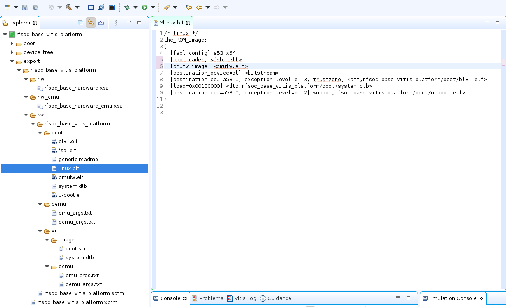

# A Vitis Extensible Platform with a single ADC for RFSoC4x2 
This is my second experiment usying the RFSoC4x2 board. The goal is to build a simple Vitis extensible platform that supports pulling samples from one ADC on the ZU48DR device on board.

## Step 0: Install the RFSoC4x2 board files
If not already installed, follow [Steps 0.1 and 0.2 in the previous experiment](./vitis_base_platform.md#step-0-install-the-rfsoc4x2-board-files-and-xilinxs-repos) to install the RFSoC board files. There is no need to install the Xilinx's device tree repo and the ZYNQMP common image here. We will use [Petalinux](https://www.xilinx.com/products/design-tools/embedded-software/petalinux-sdk.html#tools) to generate a new image and a device tree. 

## Step 1: Create a Vivado Hardware Design
1. Download the TCL script [rfsoc_adc_hardware.tcl](src/vitis_adc_platform/rfsoc_adc_hardware.tcl) to `~/workspace`.
2. Open Vivado and source the TCL script a TCL console, or simply do
   ```bash
   vivado -source rfsoc_adc_hardware.tcl
   ```
   to generate the following block design:
   
   which adds an [RF Data Converter](https://www.xilinx.com/products/intellectual-property/rf-data-converter.html#overview) IP to a slightly modified version of the hardware design in [Vitis Platform Creation Tutorial for
ZCU104-Step 1](https://github.com/Xilinx/Vitis-Tutorials/blob/2023.1/Vitis_Platform_Creation/Design_Tutorials/02-Edge-AI-ZCU104/step1.md).
   - The Vivado project is named `rfsoc_adc_hardware`.
   - ADC-D (ADC0 on tile 224) on the RFSoC4x2 board is enabled with sampling rate set to 2.4576 GSps.

3. Export the platform `rfsoc_adc_hardware.xsa` for both hardware and hardware emulation. 

## Step 2: Use Petalinux to create boot files, device tree file, linux image, rootfs, and sysroot

## Step 2: Create a Vitis Platform 
1. Create a Vitis Platform project:
 - Start `xsct`:
   ```shell
   cd ~/workspace
   xsct
   ```
 - Once in the `xsct` terminal, execute the following commands to create a Vitis platform project:
   ```tcl
   setws .
   platform create -name rfsoc_base_vitis_platform \
       -desc "A base-XRT Vitis platform for the RFSoC4x2 board" \
       -hw rfsoc_base_hardware/rfsoc_base_hardware.xsa \
       -hw_emu rfsoc_base_hardware/rfsoc_base_hardware_emu.xsa \
       -out .
   domain create -name xrt -proc psu_cortexa53 -os linux \
       -arch {64-bit} -runtime {ocl}  -bootmode {sd}
   platform write
   platform generate
   ```
   The platform is now created in `~/workspace/rfsoc_base_vitis_platform`.
   For some unknown reason, my X11 server (XQuartz) didn't let me create a platform project using the Vitis GUI.
   That's why I used `xsct` above. Also, the Vitis GUI doesn't allow specifying the two different .xsa files for
   hardware and hardware emulation.

2. Generate the device tree blob:
 - Within the xsct terminal, continue
   ```tcl
   hsi open_hw_design rfsoc_base_hardware/rfsoc_base_hardware.xsa
   hsi set_repo_path ./device-tree-xlnx/
   hsi create_sw_design device-tree -os device_tree -proc psu_cortexa53_0
   hsi set_property CONFIG.dt_zocl true [hsi::get_os]
   hsi set_property CONFIG.bootargs "console=ttyPS0,115200 clk_ignore_unused root=/dev/mmcblk0p2 rw" [hsi::get_os]
   hsi generate_target -dir ./rfsoc_base_vitis_platform/device_tree
   hsi close_hw_design [hsi current_hw_design]
   exit
   ```
 - Generate `system.dtb`:
   ```shell
   cd rfsoc_base_vitis_platform/device_tree
   gcc -E -nostdinc -undef -D__DTS__ -x assembler-with-cpp -o system.dts system-top.dts
   dtc -I dts -O dtb -o system.dtb system.dts
   ```

3. Copy `system.dtb` and boot files from the common image:
 - Make the following two directories for convenience:
   ```shell
   cd ..
   mkdir boot fat32
   ```
 - Copy `system.dtb` and other boot files to the directories:
   ```shell
   cp device_tree/system.dtb boot
   cp device_tree/system.dtb fat32
   cp ~/workspace/xilinx-zynqmp-common-v2023.1/boot.scr fat32
   cp ~/workspace/xilinx-zynqmp-common-v2023.1/bl31.elf boot
   cp ~/workspace/xilinx-zynqmp-common-v2023.1/u-boot.elf boot
   ```
   
4. Build the Vitis platform:  
 - Open up the Vitis GUI:
   ```shell
   vitis
   ```
   If the platform project doesn't show up in the **<em>Explorer</em>** window,
   either go to **<em>Vitis->XSCT Console</em>** to open up
   an xsct console and type the following command:
   ```tcl
   importprojects rfsoc_base_vitis_platform
   ```
   or go to **<em>File->Import...</em>** to import the platform project.
   The platform project created above should now show up in the **<em>Explorer</em>** window.
 - Set the platform parameters:
   - Open `platform.spr` in the **<em>Explorer</em>** window (**<em>right-click->Open</em>**)
   - Select `xrt` in the opened tab in the main window
   - Under `Domain:xrt` field:
     - `Bif File:` Click downarrow in the `Browse` button to select `Generate Bif`.
     - `Boot Components Directory:` Click the `Browse` button to select `~/workspace/rfsoc_base_vitis_platform/boot`.
     - `FAT32 Partition Directory:` Click the `Browse` button to select `~/workspace/rfsoc_base_vitis_platform/fat32`.
     - `Display Name:` Change as wish.
     - `Description:` Change as wish.
     - **Leave `Linux Rootfs:` and `Sysroot Directory:` empty**.
 - Build the platform by click the :hammer: button.
   After the build, the built Vitis platform is in `~/workspace/rfsoc_base_vitis_platform/export/rfsoc_base_vitis_platform`.
   The **<em>Explorer</em>** window in the figure below shows all the files generated in the `export` directory:
   
 - Fix the `linux.bif` file:
   - Select and open the `linux.bif` file from the **<em>Explorer</em>**.
   - Change the two lines from:
     ```
     [bootloader] <fsbl.elf>
     [pmufw_image] <pmufw.elf>
     ```
     to
     ```
     [bootloader] <rfsoc_base_vitis_platform/boot/fsbl.elf>
     [pmufw_image] <rfsoc_base_vitis_platform/boot/pmufw.elf>
     ```

## Step 3: Test the Vitis Platform
1. Create a new **Vector Addition** application from template:
 - Go to **<em>File->New->Application Project...</em>** to create a new application project.
 - The `rfsoc_base_vitis_platform` created in Step 2 should show up (if it doesn't, you can press the **+** button to add it).
   Select the platform to use.
 - Give the project a name, say `vadd`.
 - Under `Application settings` field:
   - `Sysroot path:` Click the `Browse` button to select `~/workspace/xilinx-zynqmp-common-v2023.1/sysroots/cortexa72-cortexa53-xilinx-linux`.
   - `Root FS:` Click the `Browse` button to select `~/workspace/xilinx-zynqmp-common-v2023.1/rootfs.ext4`.
   - `Kernel Image:` Click the `Browse` button to select `~/workspace/xilinx-zynqmp-common-v2023.1/Image`.
 - Select the `Simple Vector Addition` template to finish up the application project creation step.
  
2. Follow the steps in [Vitis Platform Creation Tutorial
for
ZCU104-Step 3](https://github.com/Xilinx/Vitis-Tutorials/blob/2023.1/Vitis_Platform_Creation/Design_Tutorials/02-Edge-AI-ZCU104/step3.md) to build and test the **Vector Addition** application.
