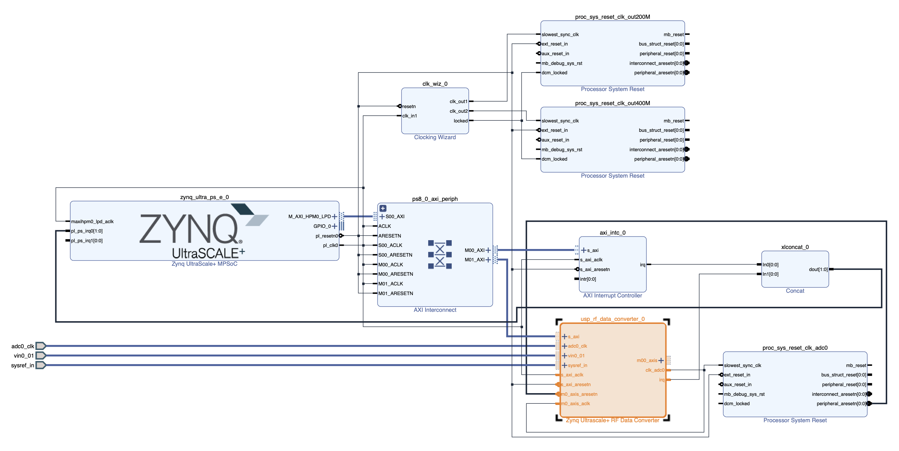

# A Vitis Extensible Platform with a single ADC for RFSoC4x2 
This is my second experiment usying the RFSoC4x2 board. The goal is to build a simple Vitis extensible platform that supports pulling samples from one ADC on the ZU48DR device on board.

## Step 0: Install the RFSoC4x2 board files
If not already installed, follow [Steps 0.1 and 0.2 in the previous experiment](./vitis_base_platform.md#step-0-install-the-rfsoc4x2-board-files-and-xilinxs-repos) to install the RFSoC board files. There is no need to install the Xilinx's device tree repo and the ZYNQMP common image here. We will use [Petalinux](https://www.xilinx.com/products/design-tools/embedded-software/petalinux-sdk.html#tools) to generate a new image and a device tree. 

## Step 1: Create a Vivado Hardware Design
1. Download the TCL script [rfsoc_adc_hardware.tcl](src/vitis_adc_platform/rfsoc_adc_hardware.tcl) to `~/workspace`.
2. Open Vivado and source the TCL script a TCL shell, or simply do
   ```bash
   vivado -source rfsoc_adc_hardware.tcl
   ```
   to generate the following block design:
   
   which adds an [RF Data Converter](https://www.xilinx.com/products/intellectual-property/rf-data-converter.html#overview) IP to a slightly modified version of the hardware design in [Vitis Platform Creation Tutorial for
ZCU104-Step 1](https://github.com/Xilinx/Vitis-Tutorials/blob/2023.1/Vitis_Platform_Creation/Design_Tutorials/02-Edge-AI-ZCU104/step1.md).
   - The Vivado project is named `rfsoc_adc_hardware`.
   - ADC-D (ADC0 on tile 224) on the RFSoC4x2 board is enabled with sampling rate set to 2.4576 GSps.

3. Export the platform `rfsoc_adc_hardware.xsa` for both hardware and hardware emulation. 

## Step 2: Use Petalinux to create boot files, device tree file, linux image, rootfs, and sysroot
1. Create a Petalinux project: 
   ```shell
   cd ~/workspace
   petalinux-create -t project --template zynqMP -n rfsoc-linux
   cd rfsoc-linux
   ```
2. Enter the hardware plotform `rfsoc_adc_hardware.xsa` and select EXT4 for rootfs:
   ```shell
   petalinux-config --get-hw-description=../rfsoc_adc_hardware/rfsoc_adc_hardware.xsa
   ```
   - Select **<em>Image Packaging Configuration->Root filesystem type->EXT4</em>**
   - Exit and save configuration
3. Add relevant libraries to rootfs:
   - Add the following line to `~/workspace/rfsoc-linux/project-spec/meta-user/conf/user-rootfsconfig`:
     ```
     CONFIG_rfdc
     ```
     to allow including the `rfdc` library (we don't use it in this experiment though)
   - Run
     ```shell
     petalinux-config -c rootfs
     ```
   - Select **<em>user packages->rfdc</em>**  
   - Select `xrt`:
     - **<em>Petalinux Package Groups->packagegroup-petalinux-vitis-acceleration-essential->packagegroup-petalinux-vitis-acceleration-essential</em>**
     - **<em>Petalinux Package Groups->packagegroup-petalinux-vitis-acceleration-essential->packagegroup-petalinux-vitis-acceleration-essential-dev</em>**
   - Select `libmetal` (mostly for `rfdc`):
     - **<em>Petalinux Package Groups->packagegroup-petalinux-openamp->packagegroup-petalinux-openamp</em>**
     - **<em>Petalinux Package Groups->packagegroup-petalinux-openamp->packagegroup-petalinux-openamp-dev</em>**
   - Select Python (to run some PYNQ scripts later):
     - **<em>Petalinux Package Groups->packagegroup-petalinux-python-modules->packagegroup-petalinux-python-modules</em>**
     - **<em>Petalinux Package Groups->packagegroup-petalinux-python-modules->packagegroup-petalinux-python-modules-dev</em>**
   - Select `openssh` for convenience:
     - **<em>Filesystem Packages->console->network->openssh->openssh, openssh-ssh, openssh-sshd, openssh-scp</em>**
   - Select **<em>Image Features->package-management</em>** and **<em>Image Features->debug-tweaks</em>**
   - Select any other packages as wish
   - Exit and save
4. Configure the Linux kernel:
   ```shell
   petalinux-config -c kernel
   ```
   - Allow user-mode SPI device driver support:
     - Select **<em>Device Drivers->SPI support->User mode SPI device driver support</em>** (select the * mark)
   - Exit and save
5. Add device tree descriptions to enable access to the reference clock chips (LMK04828 and LMX2594) via SPI:
   - Add the following lines to `~/workspace/rfsoc-linux/project-spec/meta-user/recipes-bsp/device-tree/files/system-user.dtsi`:
     ```
     /include/ "system-conf.dtsi"
     / {
        chosen {
                bootargs = " earlycon console=ttyPS0,115200 clk_ignore_unused root=/dev/mmcblk0p2 rw";
                stdout-path = "serial0:115200n8";
        };
     };

     &spi0 {
        lmk@0 {
                compatible = "ti,lmk04828";
                reg = <0x0>;
                spi-max-frequency = <500000>;
                num_bytes = <3>;
        };
        lmxdac@1 {
                compatible = "ti,lmx2594";
                reg = <0x1>;
                spi-max-frequency = <500000>;
                num_bytes = <3>;
        };
        lmxadc@2 {
                compatible = "ti,lmx2594";
                reg = <0x2>;
                spi-max-frequency = <500000>;
                num_bytes = <3>;
        };
     };
     ```
6. Build the image and sysroot:
   ```bash
   petalinux-build
   petalinux-build --sdk
   cd images/linux
   ./sdk.sh -d .
   ```
   - The boot files, device tree file, kernel image, and the EXT4 rootfs are generated in `~/workspace/rfsoc-linux/images/linux/`. The sysroot is in `~/workspace/rfsoc-linux/images/linux/sysroots/cortexa72-cortexa53-xilinx-linux`.
     
## Step 3: Create a Vitis Platform 
1. Create a Vitis Platform project:
 - Start `xsct`:
   ```shell
   cd ~/workspace
   xsct
   ```
 - Once in the `xsct` terminal, execute the following commands to create a Vitis platform project:
   ```tcl
   setws .
   platform create -name rfsoc_adc_vitis_platform \
       -desc "A Vitis extensible platform with 1 ADC for the RFSoC4x2 board" \
       -hw rfsoc_adc_hardware/rfsoc_adc_hardware.xsa \
       -hw_emu rfsoc_adc_hardware/rfsoc_adc_hardware.xsa \
       -no-boot-bsp -out .
   domain create -name xrt -proc psu_cortexa53 -os linux \
       -arch {64-bit} -runtime {ocl}  -bootmode {sd}
   platform write
   platform generate
   exit
   ```
   The platform project is now created in `~/workspace/rfsoc_adc_vitis_platform`.

2. Copy `system.dtb` and boot files from the image generated by Petalinux in Step 2 above:
 - Make the following two directories for convenience:
   ```shell
   cd rfsoc_adc_vitis_platform
   mkdir boot fat32
   ```
 - Copy `system.dtb` and other boot files to the directories:
   ```shell
   cp ~//workspace/rfsoc-linux/images/linux/system.dtb boot
   cp ~//workspace/rfsoc-linux/images/linux/system.dtb fat32
   cp ~/workspace/rfsoc-linux/images/linux/boot.scr fat32
   cp ~/workspace/rfsoc-linux/images/linux/bl31.elf boot
   cp ~/workspace/rfsoc-linux/images/linux/u-boot.elf boot
   ```
   
3. Build the Vitis platform:  
 - Open up the Vitis GUI:
   ```shell
   vitis
   ```
   If the platform project doesn't show up in the **<em>Explorer</em>** window,
   either go to **<em>Vitis->XSCT Console</em>** to open up
   an xsct console and type the following command:
   ```tcl
   importprojects rfsoc_adc_vitis_platform
   ```
   or go to **<em>File->Import...</em>** to import the platform project.
   The platform project created above should now show up in the **<em>Explorer</em>** window.
 - Set the platform parameters:
   - Open `platform.spr` in the **<em>Explorer</em>** window (**<em>right-click->Open</em>**)
   - Set the paths to `fsbl.elf` and `pmufw.elf`: 
     - `FSBL`: Click the `Browse` button to select `~/workspace/rfsoc-linux/images/linux/zynqmp_fsbl.elf`
     - `PMU Firmware`: Click the `Browse` button to select `~/workspace/rfsoc-linux/images/linux/pmufw.elf`  
   - Select `xrt` in the opened tab in the main window
   - Under `Domain:xrt` field:
     - `Bif File:` Click downarrow in the `Browse` button to select `Generate Bif`.
     - `Boot Components Directory:` Click the `Browse` button to select `~/workspace/rfsoc_adc_vitis_platform/boot`.
     - `FAT32 Partition Directory:` Click the `Browse` button to select `~/workspace/rfsoc_adc_vitis_platform/fat32`.
     - `Display Name:` Change as wish.
     - `Description:` Change as wish.
     - **Leave `Linux Rootfs:` and `Sysroot Directory:` empty**.
 - Build the platform by click the :hammer: button.
   After the build, the built Vitis platform is in `~/workspace/rfsoc_adc_vitis_platform/export/rfsoc_adc_vitis_platform`.
 - Fix the `linux.bif` file:
   - Select and open the `~/workspace/rfsoc_adc_vitis_platform/export/rfsoc_adc_vitis_platform/sw/rfsoc_adc_vitis_platform/boot/linux.bif` file from the **<em>Explorer</em>**.
   - Change the two lines from:
     ```
     [bootloader] <fsbl.elf>
     [pmufw_image] <pmufw.elf>
     ```
     to
     ```
     [bootloader] <rfsoc_adc_vitis_platform/boot/fsbl.elf>
     [pmufw_image] <rfsoc_adc_vitis_platform/boot/pmufw.elf>
     ```

## Step 4: Test the Vitis Platform
1. Prepare a bootable SD card:
   - Insert the SD card into a card reader on a Linux machine. Check its device name:
     ```shell
     lsblk -r -O
     ```
     For example, my SD card is `/dev/sda`.
   - Follow [these steps](https://xilinx-wiki.atlassian.net/wiki/spaces/A/pages/18842385/How+to+format+SD+card+for+SD+boot) to create a boot partition (FAT32) and a root partition (EXT4) on `/dev/sda`.
   - Write the rootfs to the root partition:
     ```shell
     sudo dd if=~/workspace/rfsoc-linux/images/linux/rootfs.ext4 of=/dev/sda2 bs=1M
     sudo resize2fs /dev/sda2
     ```
2. Create a new Vitis application project from template:
   - Add Vitis example templates:
     - Go to **<em>Vitis->Examples...</em>** to install example templates
     - Click the `Download` button to install the templates from the **<em>Vitis Accel Examples Repository</em>**
     - Only need to do this once
   - Go to **<em>File->New->Application Project...</em>** to create a new application project:
     - Select the `rfsoc_adc_vitis_platform` created in Step 3. If the platform doesn't show up as a choice, you can press the **+** button to add it. Press the `Next>` button.
     - Name the project `test_adc`. Press the `Next>` button.
     - Under `Application settings` field:
       - `Sysroot path:` Click the `Browse` button to select `~/workspace/rfsoc-linux/images/linux/sysroots/cortexa72-cortexa53-xilinx-linux`.
       - `Root FS:` Click the `Browse` button to select `~/workspace/rfsoc-linux/images/linux/rootfs.ext4`.
       - `Kernel Image:` Click the `Browse` button to select `~/workspace/rfsoc-linux/images/linux/Image`.
       - Press the `Next>` button.
   - Select **<em>Acceleration templates with PL and AIE accelerators->Host Examples->Data Transfer (C)</em>** to finish up the application project creation step.
  
3. Modify the kernel and host source codes:
   - Under the **<em>Explorer</em>** window, replace the file `test_adc_kernels/src/dummy_kernel.cpp` in the template with this [`dummy_kernel.cpp`](src/vitis_adc_platform/dummy_kernel.cpp).
   - Replace the file `test_adc/src/host.cpp` file in the template with this [`host.cpp`](src/vitis_adc_platform/host.cpp).
