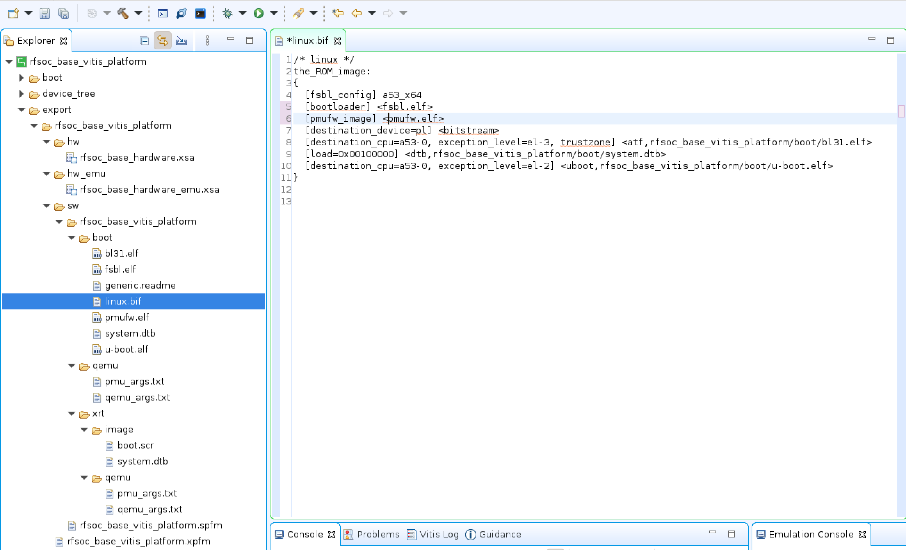

# Port <em>Vitis Platform Creation Tutorial for ZCU104</em> to RFSoC4x2 (Vitis 2023.1 Classic IDE)
My first experiment is to port the [Vitis Platform Creation Tutorial
for
ZCU104](https://github.com/Xilinx/Vitis-Tutorials/tree/2023.1/Vitis_Platform_Creation/Design_Tutorials/02-Edge-AI-ZCU104)
to the RFSoC4x2 board. 

## Step 0: Install the RFSoC4x2 board files and Xilinx's repos
1. Get the board files from the [RealDigital repo](https://github.com/RealDigitalOrg/RFSoC4x2-BSP)
   ```shell
   git clone https://github.com/RealDigitalOrg/RFSoC4x2-BSP.git ~/workspace/RFSoC4x2-BSP
   ```
    The board files are in  `~/workspace/RFSoC4x2-BSP/board_files/rfsoc4x2`.
  
2. Add the board files to Vivado:
   Add the following line to Vivado startup script `~/.Xilinx/Vivado/Vivado_init.tcl` (if the file doesn't exist, add it):
   ```tcl
   set_param board.repoPaths [list "<full path to home directory>/workspace/RFSoC4x2-BSP"]
   ```

3. Get Xilinx's device tree repo:
   ```shell
   git clone https://github.com/Xilinx/device-tree-xlnx ~/workspace/device-tree-xlnx
   cd ~/workspace/device-tree-xlnx
   git checkout xlnx_rel_v2023.1
   ```

4. Download and install the ZYNQMP common image from [Xilinx's download page](https://www.xilinx.com/support/download/index.html/content/xilinx/en/downloadNav/embedded-platforms.html). Untar it to a directory of choice:
   ```shell
   tar xzf xilinx-zynqmp-common-v2023.1.tar.gz -C ~/workspace/
   ```

5. Install the `sysroot`:
   ```shell
   cd ~/workspace/xilinx-zynqmp-common-v2023.1
   ./sdk.sh -d .
   ```

## Step 1: Create a Vivado Hardware Design
Follow the steps in [Vitis Platform Creation Tutorial
for
ZCU104-Step 1](https://github.com/Xilinx/Vitis-Tutorials/blob/2023.1/Vitis_Platform_Creation/Design_Tutorials/02-Edge-AI-ZCU104/step1.md) to generate the hardware `.xsa` files by selecting the RFSoC4x2 board instead when creating the Vivado project. 

I named the Vivado project `rfsoc_base_hardware` in `~/workspace` and generated the files:
- `rfsoc_base_hardware.xsa` for hardware
- `rfsoc_base_hardware_emu.xsa` for hardware emulation

<details>
<summary>
   $\large \color{red}\text{Beware!}$
</summary>
Make sure that there aren't any checkpoints generated when completing the block design.
That is, there should only be the folder <code>sources_1</code> in <code>~/workspace/rfsoc_base_hardware/rfsoc_base_hardware.srcs</code>.
Otherwise, when exporting the <code>.xsa</code> files, Vivado will add the checkpoints to the <code>rebuild.tcl</code> script, causing errors when Vitis uses <code>v++</code> to synthesize the platform in Step 3 below. It took me a while to figure this out.   
</details>

## Step 2: Create a Vitis Platform
1. Create a Vitis Platform project:
 - Start `xsct`:
   ```shell
   cd ~/workspace
   xsct
   ```
 - Once in the `xsct` terminal, execute the following commands to create a Vitis platform project:
   ```tcl
   setws .
   platform create -name rfsoc_base_vitis_platform \
       -desc "A base-XRT Vitis platform for the RFSoC4x2 board" \
       -hw rfsoc_base_hardware/rfsoc_base_hardware.xsa \
       -hw_emu rfsoc_base_hardware/rfsoc_base_hardware_emu.xsa \
       -out .
   domain create -name xrt -proc psu_cortexa53 -os linux \
       -arch {64-bit} -runtime {ocl}  -bootmode {sd}
   platform write
   platform generate
   ```
   The platform is now created in `~/workspace/rfsoc_base_vitis_platform`.
   For some unknown reason, my X11 server (XQuartz) didn't let me create a platform project using the Vitis GUI.
   That's why I used `xsct` above. Also, the Vitis GUI doesn't allow specifying the two different .xsa files for
   hardware and hardware emulation.

2. Generate the device tree blob:
 - Within the xsct terminal, continue
   ```tcl
   hsi open_hw_design rfsoc_base_hardware/rfsoc_base_hardware.xsa
   hsi set_repo_path ./device-tree-xlnx/
   hsi create_sw_design device-tree -os device_tree -proc psu_cortexa53_0
   hsi set_property CONFIG.dt_zocl true [hsi::get_os]
   hsi set_property CONFIG.bootargs "console=ttyPS0,115200 clk_ignore_unused root=/dev/mmcblk0p2 rw" [hsi::get_os]
   hsi generate_target -dir ./rfsoc_base_vitis_platform/device_tree
   hsi close_hw_design [hsi current_hw_design]
   exit
   ```
 - Generate `system.dtb`:
   ```shell
   cd rfsoc_base_vitis_platform/device_tree
   gcc -E -nostdinc -undef -D__DTS__ -x assembler-with-cpp -o system.dts system-top.dts
   dtc -I dts -O dtb -o system.dtb system.dts
   ```

3. Copy `system.dtb` and boot files from the common image:
 - Make the following two directories for convenience:
   ```shell
   cd ..
   mkdir boot fat32
   ```
 - Copy `system.dtb` and other boot files to the directories:
   ```shell
   cp device_tree/system.dtb boot
   cp device_tree/system.dtb fat32
   cp ~/workspace/xilinx-zynqmp-common-v2023.1/boot.scr fat32
   cp ~/workspace/xilinx-zynqmp-common-v2023.1/bl31.elf boot
   cp ~/workspace/xilinx-zynqmp-common-v2023.1/u-boot.elf boot
   ```
   
4. Build the Vitis platform:  
 - Open up the Vitis GUI:
   ```shell
   vitis
   ```
   If the platform project doesn't show up in the **<em>Explorer</em>** window,
   either go to **<em>Vitis->XSCT Console</em>** to open up
   an xsct console and type the following command:
   ```tcl
   importprojects rfsoc_base_vitis_platform
   ```
   or go to **<em>File->Import...</em>** to import the platform project.
   The platform project created above should now show up in the **<em>Explorer</em>** window.
 - Set the platform parameters:
   - Open `platform.spr` in the **<em>Explorer</em>** window (**<em>right-click->Open</em>**)
   - Select `xrt` in the opened tab in the main window
   - Under `Domain:xrt` field:
     - `Bif File:` Click downarrow in the `Browse` button to select `Generate Bif`.
     - `Boot Components Directory:` Click the `Browse` button to select `~/workspace/rfsoc_base_vitis_platform/boot`.
     - `FAT32 Partition Directory:` Click the `Browse` button to select `~/workspace/rfsoc_base_vitis_platform/fat32`.
     - `Display Name:` Change as wish.
     - `Description:` Change as wish.
     - **Leave `Linux Rootfs:` and `Sysroot Directory:` empty**.
 - Build the platform by click the :hammer: button.
   After the build, the built Vitis platform is in `~/workspace/rfsoc_base_vitis_platform/export/rfsoc_base_vitis_platform`.
   The **<em>Explorer</em>** window in the figure below shows all the files generated in the `export` directory:
   
 - Fix the `linux.bif` file:
   - Select and open the `linux.bif` file from the **<em>Explorer</em>**.
   - Change the two lines from:
     ```
     [bootloader] <fsbl.elf>
     [pmufw_image] <pmufw.elf>
     ```
     to
     ```
     [bootloader] <rfsoc_base_vitis_platform/boot/fsbl.elf>
     [pmufw_image] <rfsoc_base_vitis_platform/boot/pmufw.elf>
     ```

## Step 3: Test the Vitis Platform
1. Create a new **Vector Addition** application from template:
 - Go to **<em>File->New->Application Project...</em>** to create a new application project.
 - The `rfsoc_base_vitis_platform` created in Step 2 should show up (if it doesn't, you can press the **+** button to add it).
   Select the platform to use.
 - Give the project a name, say `vadd`.
 - Under `Application settings` field:
   - `Sysroot path:` Click the `Browse` button to select `~/workspace/xilinx-zynqmp-common-v2023.1/sysroots/cortexa72-cortexa53-xilinx-linux`.
   - `Root FS:` Click the `Browse` button to select `~/workspace/xilinx-zynqmp-common-v2023.1/rootfs.ext4`.
   - `Kernel Image:` Click the `Browse` button to select `~/workspace/xilinx-zynqmp-common-v2023.1/Image`.
 - Select the `Simple Vector Addition` template to finish up the application project creation step.
  
2. Follow the steps in [Vitis Platform Creation Tutorial
for
ZCU104-Step 3](https://github.com/Xilinx/Vitis-Tutorials/blob/2023.1/Vitis_Platform_Creation/Design_Tutorials/02-Edge-AI-ZCU104/step3.md) to build and test the **Vector Addition** application.
